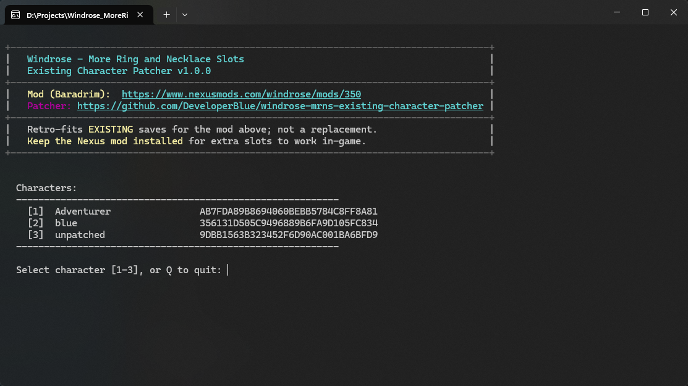

# Windrose Equipment Slots Patcher - v2.0

By **Michael Rooplall / DeveloperBlue** — [GitHub repository](https://github.com/DeveloperBlue/windrose-mrns-existing-character-patcher) · [Nexus profile](https://www.nexusmods.com/profile/DeveloperBlue)

This tool updates your **existing** Windrose character saves so you can use more equipment slots—extra ring and necklace slots, a second glove slot, and more bullet and gunpowder slots—without starting a new character. Pick your character, set how many slots you want, and the patcher writes the change directly into your save (with an automatic backup first).

**You do not need any other mods installed** to run this patcher. It works on its own. Close Windrose completely before you run it, and follow the on-screen steps (including the Steam Cloud Sync reminder after a successful patch).

These Nexus mods may link to or bundle this patcher:

- [Expanded Jewelry - More Ring and Necklace Slots](https://www.nexusmods.com/windrose/mods/___)
- [Two Glove Slots](https://www.nexusmods.com/windrose/mods/___)
- [More Bullets and Gunpowder Slots](https://www.nexusmods.com/windrose/mods/___)

## Slots managed

The patcher can change the following slot types for an existing character:

| Slot       | Range  | Vanilla |
| ---------- | ------ | ------- |
| Rings      | 1–10   | 1       |
| Necklaces  | 1–10   | 1       |
| Gloves     | 1–2    | 1       |
| Bullets    | 1–6    | 1       |
| Gunpowder  | 1–6    | 1       |

## Preview

<table>
  <tr>
    <td colspan="2" align="center"><br/><em>Existing character with extra ring & necklace slots after patching</em></td>
  </tr>
  <tr>
    <td width="50%" align="center"><br/><em>1. Select the character to patch</em></td>
    <td width="50%" align="center"><br/><em>2. Enter the slot counts matching your Nexus mod variant</em></td>
  </tr>
  <tr>
    <td width="50%" align="center"><br/><em>3. Patch complete with pre-patch backup saved</em></td>
    <td width="50%" align="center"><br/><em>4. Temporarily disable Steam Cloud Sync before launching</em></td>
  </tr>
</table>


## How to Use
> [!IMPORTANT]
> You must *temporarily disable Steam Cloud Sync* for Windrose before relaunching the game. When you launch the game, Steam pulls your old save from the cloud and overwrites the new patched save. You can and should re-enable it after you verify the patcher has worked.
>
> In **Steam** → right-click Windrose → Properties → General → uncheck *"Keep game saves in the Steam Cloud"*.
>
> If Steam asks about a conflict, pick "Use Local files".


### Running the patcher

0. Ensure the game is closed
1. Download the latest version of the patcher from [releases](https://github.com/DeveloperBlue/windrose-mrns-existing-character-patcher/releases)
2. Disable Steam Cloud Sync.<br/>In Steam → right-click Windrose → Properties → General → uncheck "Keep game saves in the Steam Cloud".
3. Run the patcher and follow the instructions
4. Launch the game and verify that you have the extra slots
5. Close the game and re-enable Steam Cloud Sync

----

If you've enjoyed this mod, want to see it maintained, or support any of my other projects, consider BuyMeACoffee!

<p align="left">
    <a href="https://buymeacoffee.com/michaelrooplall" target="_blank"></a>
</p>

---

# Building from source

If you are interested in building the code from source, follow these steps. If you don't know what this means, ignore this section.

You need [Python](https://www.python.org/) 3.10 or newer.

```bash
# Clone the project and open it
git clone https://github.com/DeveloperBlue/windrose-mrns-existing-character-patcher.git
cd windrose-mrns-existing-character-patcher

# Install dependencies:
pip install pyinstaller rocksdict

# Build
pyinstaller windrose_equipment_slots_patcher.spec
```

The compiled `windrose_equipment_slots_patcher_v<version>.exe` can be found in the `dist\` folder.

----
# FAQs

## How to backup my saves?

This tool automatically creates a backup before every patch and before every backup restore. If you want to manually backup your saves yourself, you can find them at `%LOCALAPPDATA%\R5\Saved\SaveProfiles\<STEAM_ID>\`

Backups for this tool live at `%LOCALAPPDATA%\WindroseEquipmentSlotsPatcher\Backups`.

<a id="steam-cloud-sync"></a>

## How do I disable Steam Cloud Saves?
In **Steam** → right-click Windrose → Properties → General → uncheck *"Keep game saves in the Steam Cloud"*

Note that after applying the patch, **launching the game**, and verifying that you see your slots, you should **re-enable Steam Cloud Saves**.

## My slots don't fit on screen
Depending on your monitor resolution, game resolution, and number of modified slots, some of your game UI may not fit on screen. Consider using this mod to tweak the UI scale:
[UI Scale - HUD Scale by DaraTeaGod](https://www.nexusmods.com/windrose/mods/124)

## How can I add more slots than the limit?
Run the exe with the ``--nocap`` flag. This removes the upper limits so you can set any value. **Use with care.**

```bash
./windrose_equipment_slots_patcher_v<version> --nocap
```

## How do I report a bug
If you have discovered any bugs, feel free to leave an issue here on [GitHub](https://github.com/DeveloperBlue/windrose-mrns-existing-character-patcher/issues), leave a comment on the nexus mod, or send an email over to ``contact@michaelrooplall.com``.

## Undoing the patch

If you want to "undo" the patcher and remove the extra slots:
- Re-run the patcher, select your character, and choose **Reset Slots to Vanilla** (or **Restore Backup** to roll back to an earlier snapshot).

> [!NOTE]
> You cannot reduce a slot count below a slot that still holds an item. Unequip / empty those slots in-game first, or confirm the destructive removal when prompted.

## Why isn't this just an installable mod?
After about 40+ hours of digging into the game's file dumps and running dozens and dozens of trials, I was not able to successfully inject the slots via UE4SS. If in the future anyone is able to accomplish this, I would love to know. For now, an executable tool that patches your saves is the best (and only) way I was able to release this mod.

----
# Credits

- **[More Ring and Necklace Slots](https://www.nexusmods.com/windrose/mods/350)** — inspiration for expanding ring and necklace equipment slots in Windrose.
- **`checkpoint_zip.py`** — Adapted from [agreenbeen/windrose-save-tool](https://github.com/agreenbeen/windrose-save-tool/tree/main) (rebuilds the game's `RocksDB_v2_Backups` checkpoint ZIP after patching so changes persist on load).
- **RocksDB save format** — Thanks to the same project for documenting that Windrose requires uncompressed saves in RocksDB; that cleared up a lot of headaches during development. 